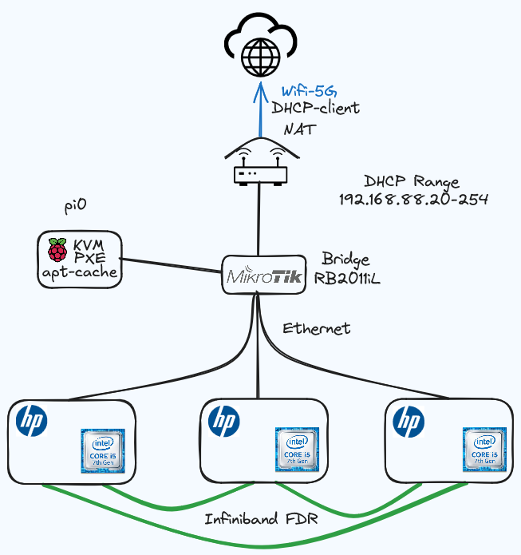

# Homelab Metal Config

This is the configuration system for the homelab cluster metal.  This is the PXE, OS Prov, and base installs of things like K3s, proxmox and network devices.


### Contents

- [Pysical Setup](#physical-composition)
    - [Mesh network config](#mesh-network-config)
    - [IB Reference](#ib-reference-information)
        - [Eth Preformance](#eth-preformance)
- [Prov Mechanism](#provisioning-mechanism)
- [Current Config](#current-configuration)
- [Alt Config](#alternate-configureation)
- [Infiniband Stuff](#infiniband-stuff)
    - [Infiniband Setup](#infiniband-setup)
    - [OpenSM](#setting-up-opensm)
    - [Important Concepts](#important-concepts)
    - [Infiniband misc info](#infiniband-misc-info)
        - [Node managment](#node-management)
        - [DBG and Diag](#debug-and-diagnostics)
        - [Network info](#network-info)
        - [IB addressing info](#ib-addressing-info)
- [Resources](#resources)
    - [proxmox](#proxmox)
- [Notes and current work](#notes-and-current-work)
    - [Future plans](#future-plans)


## Physical Composition


- 3 * HP Prodesk G5 400 SFF desktops
- 1 * Raspberry pi 4b 4gb ram
- 1 * RB2011iL routerboard





### Mesh network config


| **Interface** | **Physical Port** |
|---------------|-------------------|
| `enp1s0`      |  Port 1           |
| `enp1s0d1`    |  Port 2           |


### Physical Connection Table

| **Device**   | **Interface**    | **IP Address**    | **Connected To**   | **Connected Interface**  | **Remote IP Address** |
|--------------|------------------|-------------------|--------------------|--------------------------|-----------------------|
| **Machine0** | `enp1s0`         | 192.168.1.1/30    | **Machine1**       | `enp1s0`                 | 192.168.1.2/30       |
| **Machine0** | `enp1s0d1`       | 192.168.2.1/30    | **Machine2**       | `enp1s0`                 | 192.168.2.2/30       |
| **Machine1** | `enp1s0`         | 192.168.1.2/30    | **Machine0**       | `enp1s0`                 | 192.168.1.1/30       |
| **Machine1** | `enp1s0d1`       | 192.168.3.1/30    | **Machine2**       | `enp1s0d1`               | 192.168.3.2/30       |
| **Machine2** | `enp1s0`         | 192.168.2.2/30    | **Machine0**       | `enp1s0d1`               | 192.168.2.1/30       |
| **Machine2** | `enp1s0d1`       | 192.168.3.2/30    | **Machine1**       | `enp1s0d1`               | 192.168.3.1/30       |

### Columns:
- **Device**: The machine you're working with.
- **Interface**: The network interface on the device (either `enp1s0` or `enp1s0d1`).
- **IP Address**: The IP address assigned to that interface.
- **Connected To**: The machine that the interface is directly connected to.
- **Connected Interface**: The interface on the remote machine that is connected to the local interface.
- **Remote IP Address**: The IP address of the remote machine's connected interface.


### IB Reference information:


```bash
 sudo mstconfig query

Device #1:
----------

Device type:    ConnectX3
Device:         /sys/bus/pci/devices/0000:01:00.0/config

Configurations:                              Next Boot
         SRIOV_EN                            False(0)
         NUM_OF_VFS                          8
         LINK_TYPE_P1                        VPI(3)
         LINK_TYPE_P2                        VPI(3)
         LOG_BAR_SIZE                        3
         BOOT_PKEY_P1                        0
         BOOT_PKEY_P2                        0
         BOOT_OPTION_ROM_EN_P1               True(1)
         BOOT_VLAN_EN_P1                     False(0)
         BOOT_RETRY_CNT_P1                   0
         LEGACY_BOOT_PROTOCOL_P1             PXE(1)
         BOOT_VLAN_P1                        1
         BOOT_OPTION_ROM_EN_P2               True(1)
         BOOT_VLAN_EN_P2                     False(0)
         BOOT_RETRY_CNT_P2                   0
         LEGACY_BOOT_PROTOCOL_P2             PXE(1)
         BOOT_VLAN_P2                        1
         IP_VER_P1                           IPv4(0)
         IP_VER_P2                           IPv4(0)
```

```bash
sudo lspci -v -s 0000:01:00.0
01:00.0 Ethernet controller: Mellanox Technologies MT27500 Family [ConnectX-3]
        Subsystem: Mellanox Technologies MT27500 Family [ConnectX-3]
        Flags: bus master, fast devsel, latency 0, IRQ 16, IOMMU group 2
        Memory at cf800000 (64-bit, non-prefetchable) [size=1M]
        Memory at cf000000 (64-bit, prefetchable) [size=8M]
        Expansion ROM at <ignored> [disabled]
        Capabilities: [40] Power Management version 3
        Capabilities: [48] Vital Product Data
        Capabilities: [9c] MSI-X: Enable+ Count=128 Masked-
        Capabilities: [60] Express Endpoint, MSI 00
        Capabilities: [c0] Vendor Specific Information: Len=18 <?>
        Capabilities: [100] Alternative Routing-ID Interpretation (ARI)
        Capabilities: [148] Device Serial Number 24-8a-07-03-00-d2-c6-90
        Capabilities: [154] Advanced Error Reporting
        Capabilities: [18c] Secondary PCI Express
        Kernel driver in use: mlx4_core
        Kernel modules: mlx4_core
```

#### Eth preformance

```bash
iperf3 -c 192.168.2.1
Connecting to host 192.168.2.1, port 5201
[  5] local 192.168.2.2 port 53180 connected to 192.168.2.1 port 5201
[ ID] Interval           Transfer     Bitrate         Retr  Cwnd
[  5]   0.00-1.00   sec  1.10 GBytes  9.42 Gbits/sec    0   1.30 MBytes
[  5]   1.00-2.00   sec  1.09 GBytes  9.40 Gbits/sec    0   1.30 MBytes
[  5]   2.00-3.00   sec  1.09 GBytes  9.40 Gbits/sec    0   1.30 MBytes
[  5]   3.00-4.00   sec  1.09 GBytes  9.40 Gbits/sec    0   1.30 MBytes
[  5]   4.00-5.00   sec  1.09 GBytes  9.38 Gbits/sec    0   1.37 MBytes
[  5]   5.00-6.00   sec  1.09 GBytes  9.40 Gbits/sec    0   1.59 MBytes
[  5]   6.00-7.00   sec  1.09 GBytes  9.39 Gbits/sec    0   1.59 MBytes
[  5]   7.00-8.00   sec  1.09 GBytes  9.40 Gbits/sec    0   1.67 MBytes
[  5]   8.00-9.00   sec  1.09 GBytes  9.40 Gbits/sec    0   1.67 MBytes
[  5]   9.00-10.00  sec  1.09 GBytes  9.39 Gbits/sec    0   1.84 MBytes
- - - - - - - - - - - - - - - - - - - - - - - - -
[ ID] Interval           Transfer     Bitrate         Retr
[  5]   0.00-10.00  sec  10.9 GBytes  9.40 Gbits/sec    0             sender
[  5]   0.00-10.00  sec  10.9 GBytes  9.39 Gbits/sec                  receiver
```


## Provisioning Mechanism

## Current Configuration

## Alternate Configureation

## PXE and uefi

### UEFI PXE booting debian 12.5

There is alot of seemingly conflicting documentation online, spread over several decades, that makes it difficult to understand what is actually needed to pxe boot debian with uefi.

See [pxe_server role readme](./roles/pi_pxe_server/README.md) for information on the file structure that is served by tftp.

The [netboot](https://deb.debian.org/debian/dists/bookworm/main/installer-amd64/current/images/) image is very important.  This is different than netinstall or [netinst.iso](https://cdimage.debian.org/debian-cd/current/amd64/iso-cd/debian-12.5.0-amd64-netinst.iso) image which sounds similar.

The netboot tar contains a prebuilt directory structure that can, for the most part, be unzipped directly into the tftp server root. This page details some of this process: [wiki.debian.org/PXEBootInstall](https://wiki.debian.org/PXEBootInstall). 

### References

- [PXE 2.1 spec](https://web.archive.org/web/20230922050936/http://www.pix.net/software/pxeboot/archive/pxespec.pdf) (the site is gone sadly but docs still around)
- [DHCP and pxe rfc:4578](https://datatracker.ietf.org/doc/html/rfc4578)
- [https://wiki.debian.org/PXEBootInstall](https://wiki.debian.org/PXEBootInstall)
- [https://blog.cyberfront.org/index.php/2022/12/11/pxeboot/](https://blog.cyberfront.org/index.php/2022/12/11/pxeboot/)


## Infiniband stuff

### Infiniband setup

Understanding infiniband concepts.  Read this first!!!!!!
[https://www.cisco.com/c/en/us/td/docs/server_nw_virtual/2-10-0_release/element_manager/user_guide/appA.html#wp1008029](https://www.cisco.com/c/en/us/td/docs/server_nw_virtual/2-10-0_release/element_manager/user_guide/appA.html#wp1008029)


RDMA-Core package can be used in place of the NVIDIA OFED package.  [https://docs.nvidia.com/networking/display/rdmacore50](https://docs.nvidia.com/networking/display/rdmacore50)  also `OFED’ user-space libraries are in the rdma-core repository and the kernel components are in driver/infiniband subsystem of the linux tree.` [https://www.rohitzambre.com/blog/2018/2/9/for-the-rdma-novice-libfabric-libibverbs-infiniband-ofed-mofed](https://www.rohitzambre.com/blog/2018/2/9/for-the-rdma-novice-libfabric-libibverbs-infiniband-ofed-mofed)


#### Setting up OpenSM

Starting opensm on individual ports

[https://documentation.suse.com/smart/network/html/subnet-manager-configuring/index.html](https://documentation.suse.com/smart/network/html/subnet-manager-configuring/index.html)


```bash
sudo opensm -B -g 0x248a070300d2c692 -p P1 -f /var/log/opensm-ib1.log 
```

Where `0x248a070300d2c692` refers to the second port in `ibstat -p`

```bash
sudo ibstat -p
0x248a070300d2c691
0x248a070300d2c692
```

The `-p P1` refers to the priority of this opensm instance.  I have them as 0, 1, 2, for links 0, 1, 2. 


#### Important concepts

**Fabric:** Infiniband fabrics can be comprised of an *Infiniband Switch*, HCAs (Host Channel Adapters, like a NIC), Ethernet Gateway, Fibre Channel Gateway.

**Subnet Manager (SM)**: Subnet manager maintains the fabric.  There can be multiple, but only one primary (master). It does things such as, 
- discovers nodes
- configures nodes
    - Local Identifiers (LIDs)
    - Global Unique Identifiers (GUIDs)
    - Partition keys (P_Keys)
- configures forwarding tables
- and controls failover SMs

**Partitions (P_Key)**: Partitions are used to restrict what node are allowed to communicate.  This is similar to a VLAN.  By default, all nodes are in the partition with the *p_key* of *ff:ff*.


#### Infiniband misc info

Infiniband tools for troubleshooting and other things:

##### Node Management

- ibportstate 
    - Query, change state (i.e. disable), or speed of Port
        - `ibportstate 38 1 query`
- ibroute
    - Dumpts routes within a switch
- smpquery
    - Dumps SMP query parameters including
        - nodeinfo, nodedesc, switchinfo, pkeys, sl2vl, vlarb, guids
 
##### Debug and diagnostics

- mstregdump
    - Mellanox utility
    - dump internal registers into standard output
        - `mstregdump 13:00.0 > dumpfile_1.txt`
        - `mstregdump mthca > dumpfile_2.txt`

- ibping
    - ping a device.  Server client system
        - `ibping -S` server
        - `ibping -G 

##### Network info

- ibhosts
    - View all hosts on IB network
- ibswitches
    - View all switches on IB network
- iblinkinfo
    - View link info on ib network


[InfiniBand Linux SW Stack](https://indico.cern.ch/event/218156/attachments/351726/490091/9_OFED_SW_stack.pdf)


##### IB Addressing info


Each machine has two port.  Each port has a subnet that includes two LID (addreses), the local LID, and the remote LID.  

To view this info you can use `ibstat` and `ibhosts`.

For example, to ping `machine0` from `machine2`, we first need to start `ibping` on `machine0`. `ibping` binds to a specific port.  Lets figure out which local port we should listen on.

```bash
debian@machine0:~$ sudo ibstat -p
0x248a070300d2c691
0x248a070300d2c692
```

We see that there are two ports.  Ports in infiniband are numbered from 1 to 256.  We can check what is connected on each port with `ibhosts`.

```bash
debian@machine0:~$ sudo ibhosts -P 1
Ca      : 0x248a070300d2e670 ports 2 "machine1 ibp1s0"
Ca      : 0x248a070300d2c690 ports 2 "machine0 ibp1s0"
debian@machine0:~$ sudo ibhosts -P 2
Ca      : 0x248a070300736870 ports 2 "machine2 ibp1s0"
Ca      : 0x248a070300d2c690 ports 2 "machine0 ibp1s0"
```

This shows us that on port number 2, we have machine2 connected.

We can start `ibping` on `machine0` with `ibping -P 2 -S`.  We listen on port 2.

Now on `machine2` we check which port is connected to 

```bash
debian@machine2:~$ sudo ibhosts -P 2
Ca      : 0x248a070300d2c690 ports 2 "machine0 ibp1s0"
Ca      : 0x248a070300736870 ports 2 "machine2 ibp1s0"
```

We can see that port 2 of `machine2` is connected to `machine0`

So we can ping `machine0` now with this information.

```bash
debian@machine2:~$ sudo ibping -P 2 -L 2
Pong from machine0.(none) (Lid 2): time 0.046 ms
Pong from machine0.(none) (Lid 2): time 0.052 ms
Pong from machine0.(none) (Lid 2): time 0.066 ms
```

## Resources

### proxmox

[Proxmox VE Documentation Index](https://pve.proxmox.com/pve-docs-6/index.html)

This basically, word for word, works.  You just have to make sure to remove the enterprise repo from apt lists after you install the kernel and update and stuff.
[Install_Proxmox_VE_on_Debian_12_Bookworm](https://pve.proxmox.com/wiki/Install_Proxmox_VE_on_Debian_12_Bookworm)

Creating clusters.  It is pretty simple for simplest case. This just works
[Cluster Manager](https://pve.proxmox.com/pve-docs-6/chapter-pvecm.html)

Creating api endpoints and stuff
[Proxmox_VE_API](https://pve.proxmox.com/wiki/Proxmox_VE_API)

Neat little api explorer for proxmox
[api-viewer](https://pve.proxmox.com/pve-docs-6/api-viewer/index.html)

## Notes and current work

TODO:

- [] Write /etc/host configs for ipoib interfaces so that proxmox can use them


- [x] Write debian base provisioning role.
- [x] Add local deb repo for faster installs
- [] Write infiniband role
- ~~[] Write proxmox api setup role~~
- ~~[] Write proxmox cluster creation role~~
- [] Write k3s provision role


- [] unattended upgrades?
- [] Transition to ipxe maybe?


TOFIX:
- [x] need to add dns to preseeding
- [x] need to automate grub selection
- [x] admin wont work, reserved
- [x] force uefi install mode
- [x] confirm lvm changes
- [x] finish parts and write to disk
- [x] are you certain to part dialog
- [x] fix ssh key loading with preseeding, it doesnt create a .ssh dir for some reason
- [x] https://www.debian.org/releases/bullseye/amd64/ch06s04.en.html#completing-installed-system  isenkram-autoinstall-firmware
- [x] Set hostname correctly


### Future plans

#### ipxe update
[https://linuxhint.com/pxe_boot_ubuntu_server/](https://linuxhint.com/pxe_boot_ubuntu_server/)